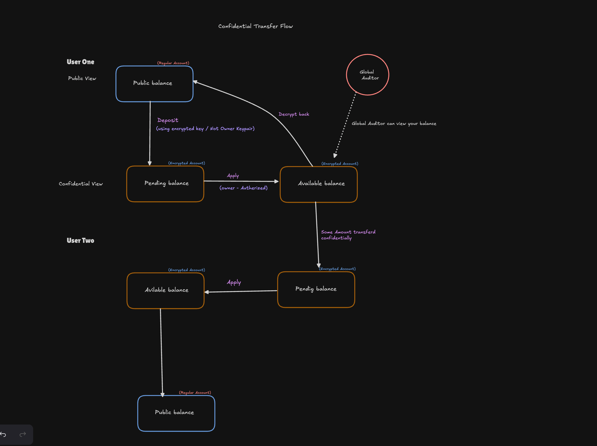
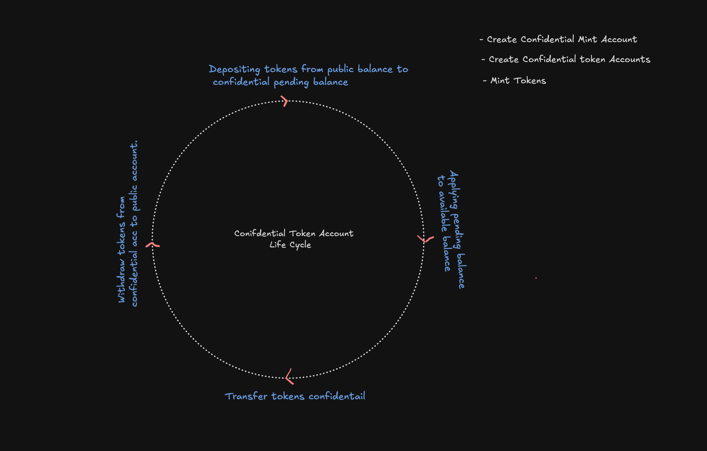

# Confidential Solana Token Example

This project demonstrates how to use Solana's SPL Token 2022 program with the Confidential Transfer extension. It enables private token transfers using zero-knowledge proofs (ZKPs). The code is written in Rust and uses the Solana and SPL Token client libraries.

## What Are Confidential Tokens?

Confidential tokens on Solana allow you to transfer tokens privately. While token account addresses are public, the actual balances and transfer amounts are hidden using encryption. Only you (and optionally an **auditor**) know your balance, but you can still send and receive tokens securely and privately.

## What Are Zero-Knowledge Proofs?

Zero-knowledge proofs (ZKPs) are cryptographic tools that let you prove something is true without revealing the underlying secret. In confidential token transfers, ZKPs prove the transfer is valid without revealing the amount or sensitive account details.

## ElGamal Encryption in Confidential Transfers

ElGamal encryption is used to keep token amounts private. Each confidential token account generates its own ElGamal keypair. When tokens are transferred or deposited, the amounts are encrypted with the recipient's ElGamal public key. Only the account owner can decrypt and view their balance.

This ensures:
- Transaction amounts are hidden from everyone except the intended recipient.
- ZKPs prove the validity of transactions without revealing amounts.
- The system maintains privacy while still allowing the blockchain to verify all operations are correct.

## Features

- **Create a confidential mint**: Deploy a new SPL Token mint with the Confidential Transfer extension.
- **Create confidential token accounts**: Set up token accounts for users (e.g., Alice and Bob) with confidential transfer capabilities.
- **Mint tokens**: Mint tokens to a confidential token account.
- **Deposit tokens confidentially**: Move tokens into a confidential (private) balance using ZKPs.
- **Confidential transfer**: Privately transfer tokens between accounts without revealing the amount on-chain.
- **Apply pending balances**: Move deposited tokens from a pending state to an available confidential balance.

## How It Works

- All transactions are verified by the network, but only the account owner (and auditor, if configured) knows the amounts.
- Each operation (deposit, transfer, withdraw) involves generating and submitting ZK proofs on the client side.
- The on-chain program checks the cryptographic validity of these proofs and rejects any invalid attempts.

## Confidential Transfer Flow



## Pending and Available Balances

When you deposit tokens into a confidential token account, they first go into a **pending balance**. After the deposit, you must "apply" the pending balance to move tokens into the **available balance**. Only tokens in the available balance can be used for confidential transfers or withdrawals. This two-step process helps ensure privacy and security.

## Confidential Token Account Lifecycle



### Funds Flow

1. **Deposit**: Public tokens are deposited and converted into a confidential pending balance (encrypted).
2. **Apply**: The pending balance is moved to available balance—still encrypted, now ready for confidential transfers.
3. **Confidential Transfer**: The sender generates ZK proofs for the transfer. The recipient’s pending balance is increased; the sender’s is decreased (both encrypted).
4. **Apply (Recipient)**: The recipient applies their pending balance, making it available for further confidential use.
5. **Withdraw (Optional)**: The recipient can withdraw from confidential available balance back to public balance, using ZK proofs.

## File Structure

- `src/main.rs`: Main entry point. Orchestrates the confidential mint, account creation, minting, deposit, and transfer steps.
- `src/helper.rs`: Helper functions for keypair generation, transaction handling, and account inspection.
- `src/confidential/`: Modules for each confidential token operation:
  - `confidential_mint.rs`: Create a confidential mint.
  - `confidential_token_account.rs`: Create confidential token accounts.
  - `confidential_deposit_token.rs`: Deposit tokens confidentially.
  - `confidential_transfer_tokens.rs`: Confidential token transfer logic.
  - `apply_pending_balance.rs`: Apply pending confidential balances.
  - `confidential_withdraw_tokens.rs`: Withdraw confidential tokens.

## Prerequisites

- Rust toolchain
- Solana CLI and local validator running (`solana-test-validator`)
- The required Solana and SPL Token 2022 Rust crates

## Running the Example

1. Start a local Solana validator:
   ```sh
   solana-test-validator --clone-upgradeable-program TokenzQdBNbLqP5VEhdkAS6EPFLC1PHnBqCXEpPxuEb --url https://api.mainnet-beta.solana.com -r
   ```
2. Build and run the project:
   ```sh
   cd confidential-solana
   cargo run
   ```

You should see logs for each step: mint creation, account setup, minting, deposit, and confidential transfer.

## Problems Faced

| Problem                                                                                                  | Reason                                                                             | Solution                                                                                                |
| -------------------------------------------------------------------------------------------------------- | ---------------------------------------------------------------------------------- | ------------------------------------------------------------------------------------------------------- |
| Unable to find proper reference for building confidential program using Anchor and no JS SDK for testing | Lack of documentation and SDK support for confidential programs with Anchor and JS | Built from the client side using the `spl-token-2022` crate after exploring available resources         |
| Unable to create confidential token account                                                              | `spl-token-2022` is not supported by the default local validator                   | Manually installed the mainnet validator and then started creating confidential token accounts          |

## Notes

- This example is for educational purposes and uses insecure keypair generation for demonstration.
- The confidential transfer feature relies on zero-knowledge proofs and special cryptographic keys (ElGamal, AES).
- Withdraw logic is implemented similarly to deposit/apply logic.

## References

- [Solana Confidential Transfer Helius Blog](https://www.helius.dev/blog/confidential-balances)
- [Solana Confidential Transfer Quicknode Blog](https://www.quicknode.com/guides/solana-development/spl-tokens/token-2022/confidential#:~:text=The%20Confidential%20Transfer%20extension%20enables,tokens%20without%20revealing%20the%20amounts)
- [Solana Confidential Transfers](https://github.com/solana-foundation/solana-com/blob/main/content/docs/en/tokens/extensions/confidential-transfer/index.mdx)

---

Feel free to explore the code and experiment with confidential token operations on your local Solana network!
